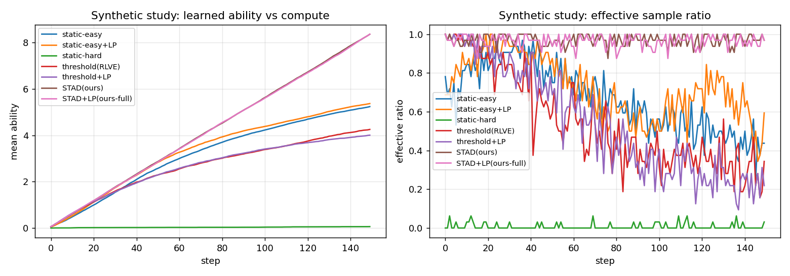

# RLVE-lite results report

## CPU simulation (mechanism validation)

| condition | mean final ability | eff-ratio (all) | eff-ratio (last50) | success (last50) |
|---|---|---|---|---|
| static-easy | 5.239 | 0.667 | 0.490 | 0.854 |
| static-easy+LP | 5.370 | 0.722 | 0.634 | 0.726 |
| static-hard | 0.061 | 0.008 | 0.009 | 0.001 |
| threshold(RLVE) | 4.254 | 0.545 | 0.334 | 0.945 |
| threshold+LP | 4.006 | 0.543 | 0.265 | 0.963 |
| STAD(ours) | 8.362 | 0.970 | 0.968 | 0.535 |
| STAD+LP(ours-full) | 8.362 | 0.964 | 0.965 | 0.537 |

## Figures

