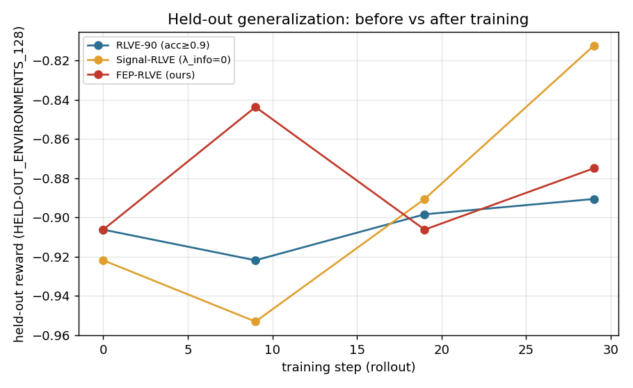
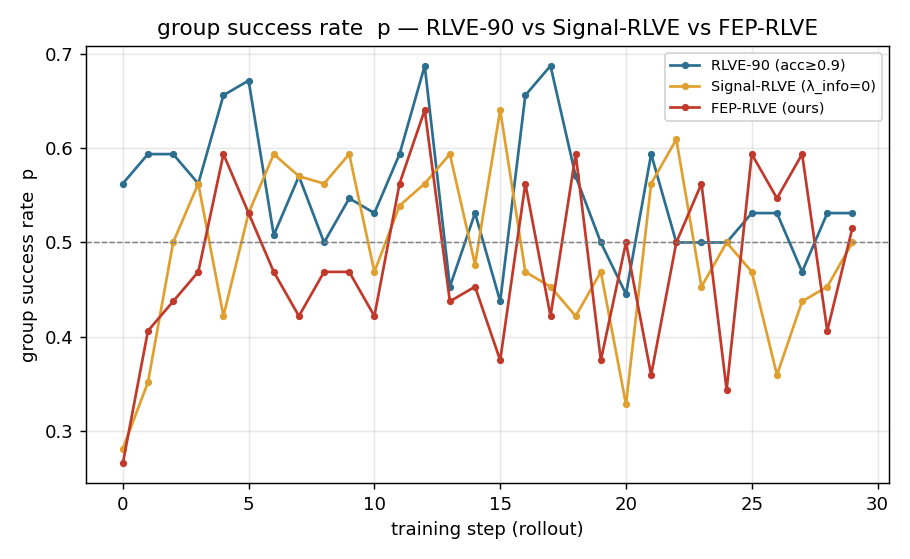
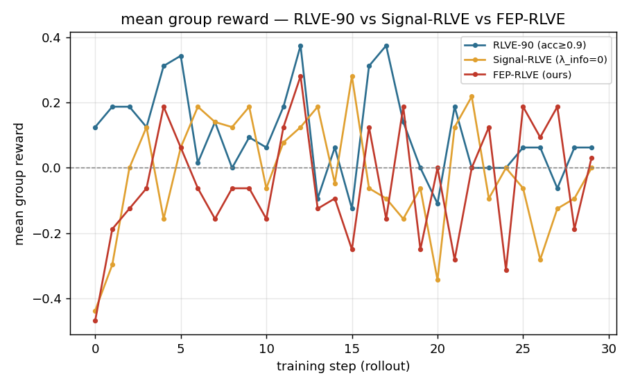
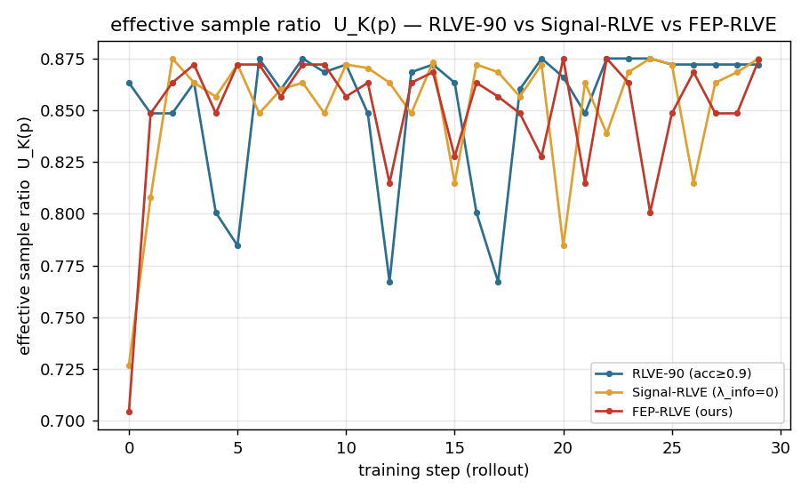
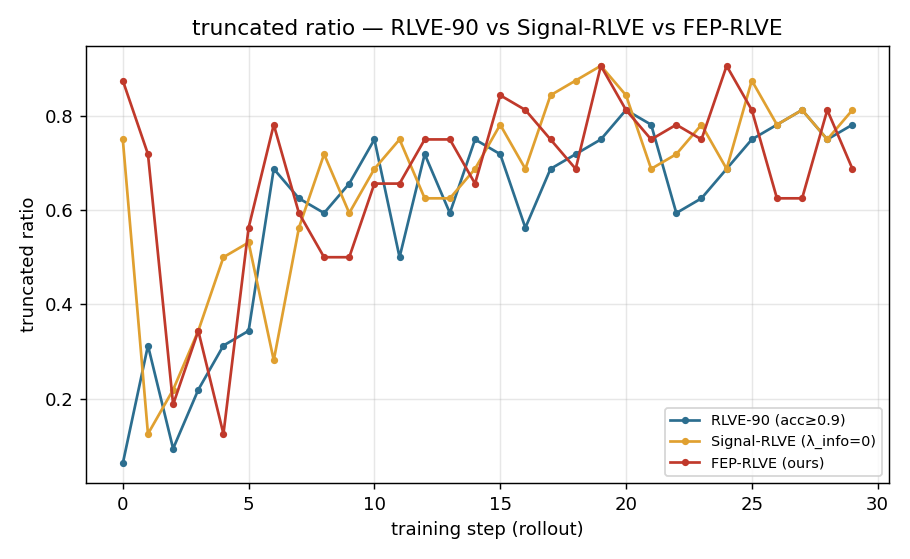

# RLVE Difficulty Strategy Report

## Experiment Setup

This run compares three difficulty-selection strategies on the same RLVE/ProRL-1.5B-v2 setup:

| Arm | Strategy | Notes |
|---|---|---|
| adaptive | Original RLVE-90 curriculum | Increase difficulty when recent accuracy exceeds the RLVE threshold. |
| signal | Signal-RLVE ablation | Uses the effective-sample signal objective with `lambda_info=0`. |
| fep | FEP-RLVE | Uses Expected Free Energy with both signal and epistemic information gain. |

Run configuration:

- `NUM_ENV=4`
- `MAX_STEPS=30`
- `N_SAMPLES=4`, so the effective sample ratio is computed with `K=4`
- `RESP_LEN=2048`
- `ROLLOUT_BSZ=8`
- `OVERSAMPLE=8`
- Evaluation approximately every 10 rollouts, giving eval points at steps `0, 9, 19, 29`

The logs confirm that the modified managers were active for the two non-baseline arms:

- `signal`: `[FEP-RLVE] mode=signal ... lambda_info=0.0`
- `fep`: `[FEP-RLVE] mode=fep ... lambda_info=1.0`

## Summary Results

| arm | steps | mean success | mean effective ratio | last-5 success | final held-out |
|---|---:|---:|---:|---:|---:|
| adaptive / RLVE-90 | 30 | 0.552 | 0.853 | 0.519 | -0.890625 |
| signal | 30 | 0.491 | 0.852 | 0.444 | **-0.812500** |
| fep | 30 | 0.477 | 0.850 | 0.531 | -0.875000 |

The strongest result in this short-budget run is that **Signal-RLVE achieves the best held-out final score**, improving from `-0.921875` to `-0.812500`. FEP-RLVE also improves over its initial held-out score, but less strongly. Adaptive/RLVE-90 has the best in-training reward and success rate, but the weakest held-out improvement.

## Held-Out Generalization

Held-out trajectory:

| arm | eval 0 | eval 9 | eval 19 | eval 29 | delta |
|---|---:|---:|---:|---:|---:|
| adaptive | -0.906250 | -0.921875 | -0.898438 | -0.890625 | +0.015625 |
| signal | -0.921875 | -0.953125 | -0.890625 | **-0.812500** | **+0.109375** |
| fep | -0.906250 | -0.843750 | -0.906250 | -0.875000 | +0.031250 |

Signal-RLVE shows the clearest late improvement on held-out environments. FEP-RLVE improves by the end as well, but its trajectory is noisier: it jumps up at eval 9, falls back at eval 19, then recovers at eval 29. This is consistent with an exploratory epistemic component under a very short training horizon.

## Training Success And Reward

Adaptive/RLVE-90 has the highest mean training success and reward:

| arm | mean reward | first-5 reward | last-5 reward | mean success | first-5 success | last-5 success |
|---|---:|---:|---:|---:|---:|---:|
| adaptive | 0.1031 | 0.1875 | 0.0375 | 0.5516 | 0.5938 | 0.5187 |
| signal | -0.0177 | -0.1531 | -0.1125 | 0.4912 | 0.4234 | 0.4438 |
| fep | -0.0469 | -0.1313 | 0.0625 | 0.4766 | 0.4344 | 0.5313 |

This creates an important contrast: **the arm with the best in-training score is not the arm with the best held-out score**. Adaptive appears to optimize the training environments more directly, while Signal-RLVE gives lower in-training success but better held-out performance in this run.

## Effective Sample Ratio

All three arms have similar effective sample ratios:

| arm | mean effective ratio | first-5 | last-5 |
|---|---:|---:|---:|
| adaptive | 0.8527 | 0.8448 | 0.8721 |
| signal | 0.8519 | 0.8259 | 0.8587 |
| fep | 0.8496 | 0.8273 | 0.8576 |

The effective ratio is high for all arms because success rates mostly stay near the informative band around `p=0.5`, and with `K=4`, `U_K(p)=1-p^K-(1-p)^K` remains high over a broad middle range. Therefore this figure supports that all runs produced usable GRPO signal, but it does not by itself establish a large separation between the methods.

## Truncation

Truncation is the main reliability caveat:

| arm | mean truncated | first-5 truncated | last-5 truncated | mean response length |
|---|---:|---:|---:|---:|
| adaptive | 0.6010 | 0.2000 | 0.7750 | 1878.9 |
| signal | 0.6615 | 0.3875 | 0.8063 | 1894.5 |
| fep | 0.6740 | 0.4500 | 0.7125 | 1914.0 |

The eval truncated ratios are also very high, usually around `0.93-0.98`. Since `RESP_LEN=2048`, many responses are hitting the length limit. This means held-out rewards are likely suppressed by truncation, and differences between methods should be treated as preliminary rather than definitive.

## Interpretation

The short-run result favors **Signal-RLVE** on held-out generalization. A plausible explanation is that Signal-RLVE directly targets the high-gradient region where rollout groups are neither all-correct nor all-wrong. Under a small training budget, this direct objective can be more efficient than the original RLVE-90 threshold rule.

Adaptive/RLVE-90 obtains higher training success, but that does not translate into the best held-out performance. This suggests it may be spending more effort on difficulties that are favorable for training-environment reward rather than maximizing generalization signal.

FEP-RLVE does not outperform Signal-RLVE in this 30-step run. This does not invalidate the FEP idea; rather, it suggests the epistemic term may need more steps or less severe truncation to pay off. The information-gain component encourages exploration of uncertain ability/difficulty regions. In a very short run with high truncation, that exploration can add variance and delay immediate held-out gains.

## Conclusion

For this deadline-constrained run:

1. **Signal-RLVE is the strongest empirical result**: it has the best final held-out score and largest held-out improvement.
2. **FEP-RLVE is active and shows positive movement**, but it is not yet better than Signal-RLVE under this short, highly truncated setting.
3. **Adaptive/RLVE-90 has the best training reward but weaker generalization**, supporting the project motivation that training success alone is not the right curriculum signal.
4. The result should be reported as a preliminary short-budget comparison because response truncation is high.

Recommended wording for the poster/report:

> In a short 30-rollout, 4-environment run, Signal-RLVE achieved the best held-out improvement despite lower training success, suggesting that targeting the informative-sample band can improve generalization efficiency. FEP-RLVE was active and improved over its initial score, but did not yet surpass the signal-only ablation, likely due to the very short horizon and severe response truncation. These results are preliminary but support the central claim that curriculum objectives should optimize learning signal rather than raw training accuracy.
